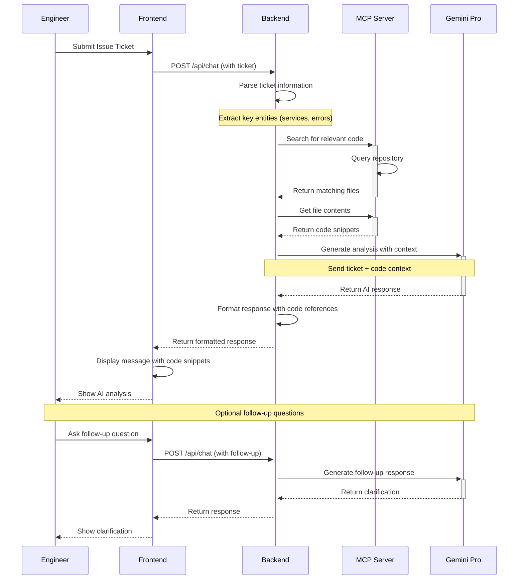

```mermaid
sequenceDiagram
    participant E as Engineer
    participant F as Frontend
    participant B as Backend
    participant M as MCP Server
    participant G as Gemini Pro

    E->>F: Submit Issue Ticket
    F->>B: POST /api/chat (with ticket)
    B->>+B: Parse ticket information
    Note over B: Extract key entities (services, errors)

    B->>+M: Search for relevant code
    M->>M: Query repository
    M-->>-B: Return matching files
    
    B->>+M: Get file contents
    M-->>-B: Return code snippets
    
    B->>+G: Generate analysis with context
    Note over B,G: Send ticket + code context
    G-->>-B: Return AI response
    
    B->>B: Format response with code references
    B-->>F: Return formatted response
    
    F->>F: Display message with code snippets
    F-->>E: Show AI analysis

    Note over E,G: Optional follow-up questions
    
    E->>F: Ask follow-up question
    F->>B: POST /api/chat (with follow-up)
    B->>+G: Generate follow-up response
    G-->>-B: Return clarification
    B-->>F: Return response
    F-->>E: Show clarification
```